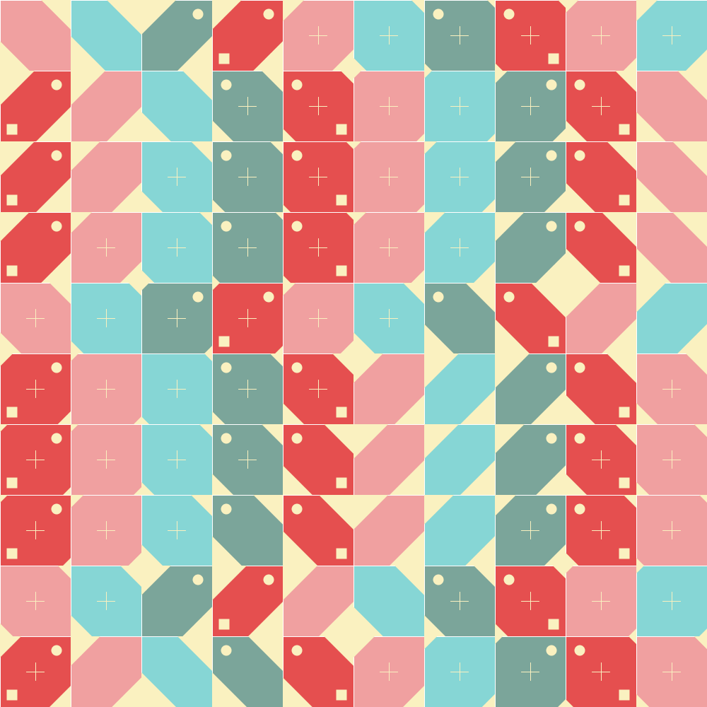
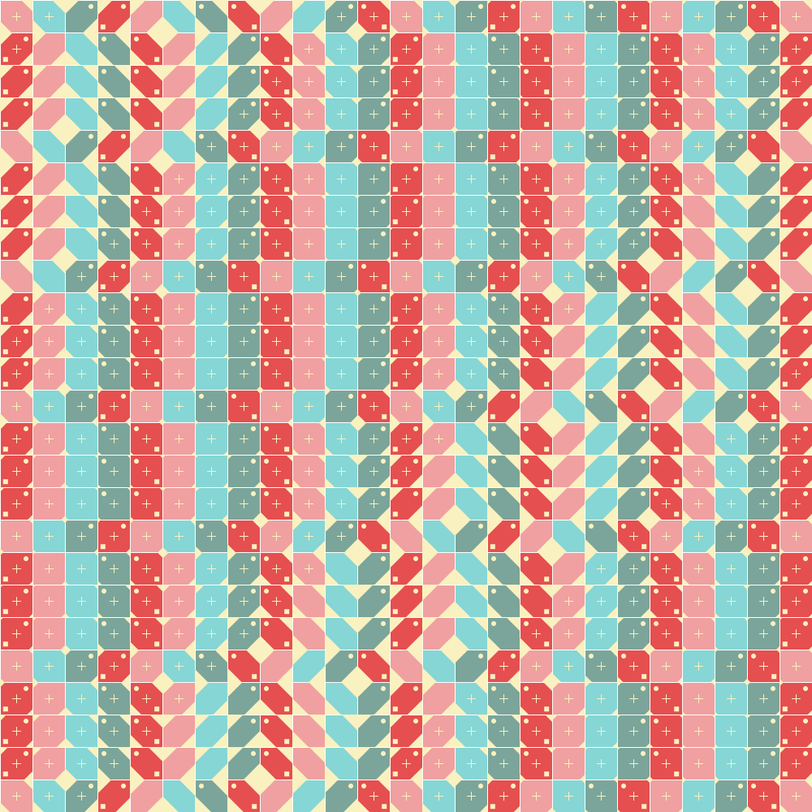
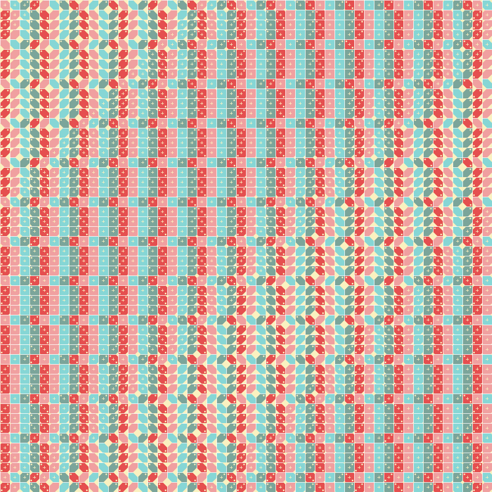

## Design Description

The main design concept of my pattern is layered with multiple variation approaches to create micro and macro repetitions. While playing with simple geometric shapes, I have decided to have a square with two triangles at opposite corners (a hexagon) as a basic shape in my pattern. There are two patterns for rotation of hexagons; one has the reverse order of the other (i.e., clockwise and counter clockwise). A pattern type and rotation value are determined by column and row indices of the grid, respectively. According to the rotation value, the color of a hexagon is also selected. On top of a hexagon, it draws three decorative shapes by rules: a circle, square, and cross; Circles and squares are drawn according to a color index, whereas the value of a sine function with the center position of each grid cell decides whether it will draw a cross. Also, this sine value varies a hexagon size, resulting in a diagonal wavy pattern in overall.

### Results

#### 10x10 Grid

#### 25x25 Grid

#### 50x50 Grid

