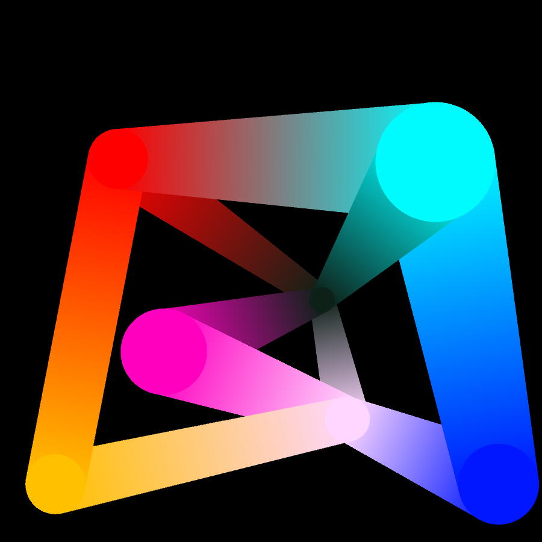

## Networked Color Mixer

This color picker consists of principal color nodes and gradient edges between nodes. The user can add 
principal color nodes by clicking on an empty space and make an edge by dragging from one node to another node. The edge shows a gradient color spectrum based on the colors of two end nodes. It is possible to add nodes for color stops with a left mouse click on an edge. With a right mouse click, the user can delete a node or an edge. With keys and mouse dragging, the user can change the hue/saturation/brightness, radius, and position of a node. As a network, the radius or color change of a node affects the shapes and gradient colors of connected edges. It also remembers the color of the last node being created, selected or deleted so that the user can start with a node with the last color that the user played with before.

This picker is intended for the user who wants to find possible color variations based on the main colors being selected. With gradient color edges and flexible color stops, it tries to support a color mixing practice.

